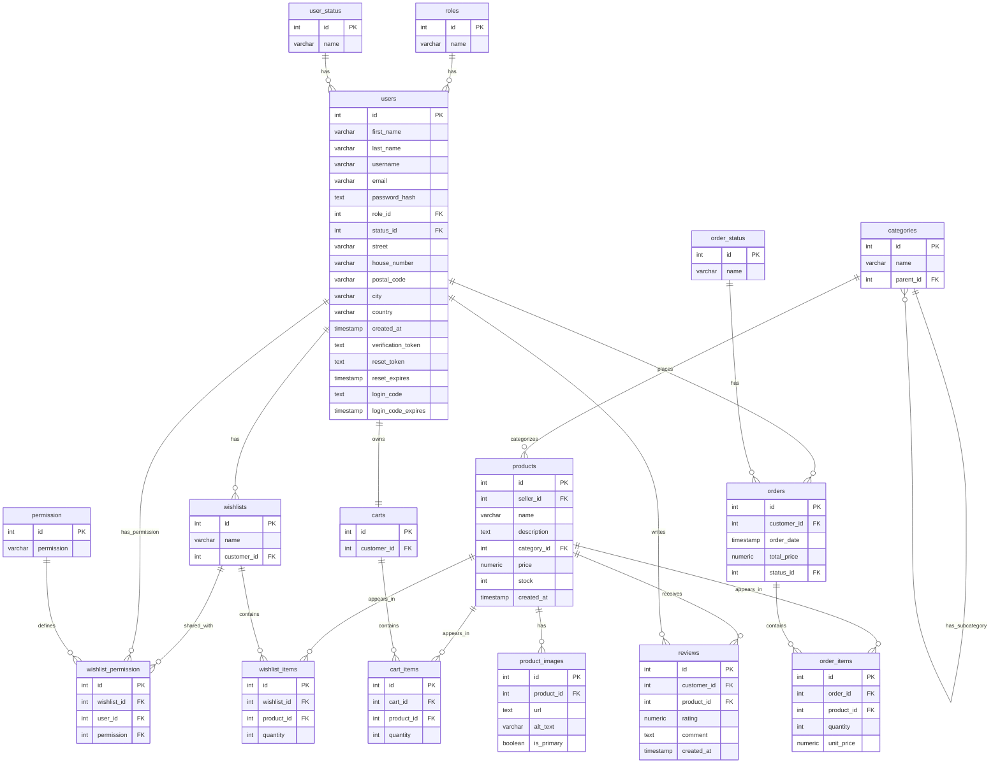

# Database

The application uses **PostgreSQL** as its relational database.

---

## 🧾 Schema

The schema is defined in `backend/db/init.sql`. Tables include:

- `users`, `roles`, `products`, `categories`
- `product_images`, `wishlists`, `carts`, `orders`, `reviews`, etc.

Each table uses appropriate foreign keys and cascading rules to ensure data integrity and normalization.



---

## 🌱 Seed Data

The following static reference data is inserted directly in the `scheme.sql` file:

`permission`
| ID | Permission  |
|----|-------------|
| 1  | readOnly    |
| 2  | write       |

`user_status`
| ID | Status        |
|----|---------------|
| 1  | validated     |
| 2  | notValidated (default) |

`order_status`
| ID | Status      |
|----|-------------|
| 1  | Pending     |
| 2  | Processing  |
| 3  | Shipped     |
| 4  | Delivered   |
| 5  | Cancelled   |

`roles`
| ID | Role      |
|----|-----------|
| 1  | Admin     |
| 2  | Seller    |
| 3  | Customer (default) |

Initial demo data is defined in `backend/db/xx_table_seed.sql`:
the INSETS will be executed in this special order

- `categories`
- `users`
- `products`
- `productImages`
- `wishlists`
- `wishlistItems`
- `carts`
- `cartItems`
- `orders`
- `orderItems`
- `reviews`
- `wishlistPermissions`

---

### User Data Seed

This SQL script inserts initial user data into the users table. The users are categorized into three roles: Admins, Sellers, and Customers. Each user entry includes personal information, login credentials, role assignments, and address details.

---

#### Roles and Credentials

Admins (role_id = 1)
Username examples: admin1, admin2, etc.
Password hash corresponds to password: Admin123!
Status can be active (1) or inactive (2) (admin3 is invalid)

Sellers (role_id = 2)
Username examples: seller1, seller2, etc.
Password hash corresponds to password: Seller123!
Status can be active (1) or inactive (2) (seller3 is inactive)

Customers (role_id = 3)
Username examples: customer1, customer2, etc.
Password hash corresponds to password: Customer123!
Status can be active (1) or inactive (2) (customer3 is inactive)

This allows you to test the webshop locally with realistic records.

---

## ⚙️ Configuration

Docker Compose uses a `postgres:16` image with the following environment:

```yaml
environment:
  POSTGRES_USER: postgres
  POSTGRES_PASSWORD: postgres
  POSTGRES_DB: webshop
```

The backend connects via:

```env
DATABASE_URL=postgres://postgres:postgres@db:5432/webshop
```

---

## 🧪 Testing Locally

To launch the full stack:

```bash
./start.sh
```

Or, for dev mode (with live-reload of frontend/backend):

```bash
./start.sh --dev
```

You can then connect to the DB using a GUI (e.g. DBeaver):

- **Type:** PostgreSQL
- **Host:** localhost
- **Port:** 5432
- **Database:** webshop
- **User:** postgres
- **Password:** postgres

---

## 🔄 Reset Database

To wipe the DB and re-seed everything:

```bash
./start.sh --resetDB
```

Or in dev mode:

```bash
./start.sh --dev --resetDB
```

This will run the SQL in `backend/db/init.sql` to recreate the schema and demo data.