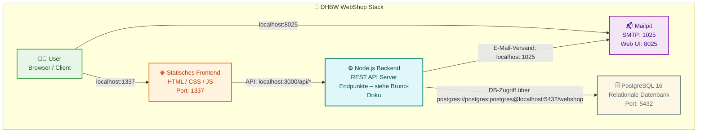

# 🐳 Docker Setup – DHBW WebShop

This project uses **Docker Compose** to orchestrate the full-stack webshop — including backend, frontend, database, and mail service.

---

## 📦 Services Overview



| Service    | Description                        | Role                                  | Port(s)           |
|------------|------------------------------------|---------------------------------------|-------------------|
| `db`       | PostgreSQL 16                      | Relational database                   | `5432`            |
| `backend`  | Node.js server                     | REST API                              | `3000`    |
| `frontend` | Static HTML/JS/CSS (Vite/Nginx)    | Frontend client interface             | `1337`            |
| `mailpit`  | Mailpit                            | SMTP + Mail UI                        | `1025`, `8025`    |

---

## ⚙️ Running the Stack

To start all services in **production mode**:

```bash
./start.sh
```

For **development mode**:

```bash
./start.sh --dev
```

To reset the db please add the flag:

```bash
--resetDB
```

---

## 🧹 Cleanup

please use ctrl + c to stop the services

```bash
docker compose down            # Stop containers
docker compose down -v         # Remove volumes
docker rmi webshop_backend webshop_frontend  # Optional: remove old images
```

---

## 📁 Notes

- Backend uploads mapped to `./backend/uploads`
- Database initialized from `./backend/db/`
- Mail service via Mailpit: [localhost:8025](http://localhost:8025)
